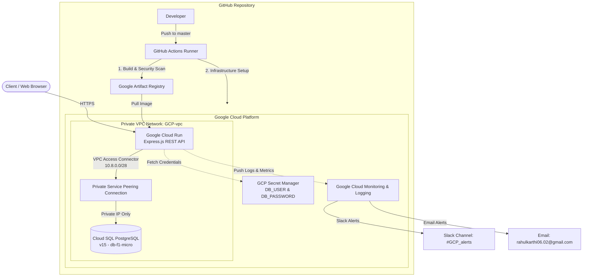

# Google Cloud Platform (GCP) Cloud-Native REST API & IaC Assessment

This repository contains a fully production-ready, cloud-native Node.js/Express REST API deployed to **Google Cloud Run** using a fully automated GitOps approach. Infrastructure is provisioned via **Terraform (IaC)**, and continuous integration & delivery are handled via **GitHub Actions**.

The architecture incorporates private networking, database isolation, automated security scanning, secret management, and a robust alerting setup integrated with Slack and Email.

---

## 🏗️ Architecture Blueprint

The diagram below outlines the secure VPC topology, compute resources, database peering, and the CI/CD deployment flow:



---

## 🚀 Key Features

* **Secure Serverless Compute:** Express.js REST API hosted on Google Cloud Run with scale-to-zero capability (min: 0, max: 5 instances) to optimize costs.
* **Isolated Cloud SQL Database:** Private-only PostgreSQL instance peered with the VPC, preventing any external internet exposure.
* **Enterprise Security Architecture:**
  * **Static Application Security Testing (SAST):** Scans containers using **Trivy**, dependencies using `npm audit`, and Terraform code using `tfsec` and `tflint`.
  * **Runtime Secret Injection:** Automated runtime ingestion of database credentials from **GCP Secret Manager**.
  * **Least-Privilege Access (IAM):** Separate service accounts for local runtimes and GitHub Actions deployment.
* **Observability & Proactive Alerting:** Log-based metrics and custom alerting policies notifying Slack channels and administrator emails of performance thresholds.
* **Declarative GitOps Pipelines:** Fully version-controlled Terraform state and container build pipelines triggering on code updates.

---

## 📁 Repository Structure

```text
GCP-project/
├── .github/workflows/
│   ├── deploy.yml            # Container build, security scan, and Cloud Run deployment
│   └── infra-setup.yaml      # Terraform formatting, linting, security scans, and provisioning
├── app/                      # Express.js REST API application code
│   ├── src/
│   │   ├── app.js            # Express application entry point
│   │   ├── db.js             # PostgreSQL Pool setup and table initialization
│   │   └── routes.js         # API Route definitions (health, database, CPU test workloads)
│   ├── Dockerfile            # Container definition
│   ├── package.json          # Node dependencies, testing, and security audit scripts
│   └── eslint.config.mjs     # Linter configuration
├── gcp/                      # Infrastructure-as-Code (Terraform)
│   ├── main.tf               # Provider initialization
│   ├── locals.tf             # Shared resource naming conventions and configurations
│   ├── vpc.tf                # VPC, subnets, and serverless VPC access connector
│   ├── db.tf                 # Cloud SQL PostgreSQL database & private network peering
│   ├── cloudrun.tf           # Cloud Run deployment, service account, and IAM permissions
│   ├── secrets.tf            # Secret Manager setup and automated secret versioning
│   ├── monitoring.tf         # Alert notification channels, log-based metrics, and CPU policies
│   ├── gcr.tf                # Artifact Registry repository definition
│   ├── iam.tf                # IAM assignments for deployment and runtime
│   ├── firewall.tf           # Network firewall settings
│   └── outputs.tf            # Deployment logs and resources identifiers
└── README.md                 # Project documentation
```

---

## 📡 API Specification

The API operates by default on port `8080` (or the environment variable `PORT`).

### 1. Health Check
Checks the status of the Express server.
* **Method:** `GET`
* **Path:** `/api/health`
* **Response:**
  ```json
  { "status": "ok" }
  ```

### 2. Retrieve All Users
Queries the PostgreSQL instance and returns all registered users.
* **Method:** `GET`
* **Path:** `/api/users`
* **Response:**
  ```json
  [
    {
      "id": 1,
      "name": "Jane Doe",
      "email": "jane.doe@example.com"
    }
  ]
  ```

### 3. Create User
Adds a new user record to the PostgreSQL `users` table. The table schema is generated automatically on application startup.
* **Method:** `POST`
* **Path:** `/api/users`
* **Headers:** `Content-Type: application/json`
* **Body:**
  ```json
  {
    "name": "Jane Doe",
    "email": "jane.doe@example.com"
  }
  ```
* **Response:**
  ```json
  {
    "id": 1,
    "name": "Jane Doe",
    "email": "jane.doe@example.com"
  }
  ```

### 4. CPU Workload Simulator
Generates a multi-threaded compute workload using Worker Threads across all available CPU cores. Primarily used to test scaling and alerting policies.
* **Method:** `GET`
* **Path:** `/api/cpu-load`
* **Query Parameters:**
  * `duration` *(optional)*: Duration of load execution in milliseconds. (Default: `5000`)
  * `load` *(optional)*: Percentage of CPU load simulation per core. (Default: `85`)
* **Example Request:** `/api/cpu-load?duration=10000&load=90`
* **Response:**
  ```json
  {
    "message": "CPU load ~90% on 2 cores for 10s"
  }
  ```

---

## 💻 Local Development

Follow these steps to run the application codebase on your local machine:

### 1. Prerequisites
* Node.js **v18+** & npm installed.
* Docker desktop/engine installed.
* An active PostgreSQL database server (e.g. running locally).

### 2. Clone and Install Dependencies
```bash
git clone https://github.com/Rahul-ramakrishnan06/GCP-project.git
cd GCP-project/app
npm install
```

### 3. Set Up Environment Variables
Create a local `.env` file or configure your terminal environment variables:
```env
DB_HOST=127.0.0.1
DB_PORT=5432
DB_USER=your_postgres_user
DB_PASSWORD=your_postgres_password
DB_NAME=postgres
PORT=8080
```

### 4. Run the Application
* **Development Mode** (with hot-reloading):
  ```bash
  npm run dev
  ```
* **Production Build / Start:**
  ```bash
  npm start
  ```
* **Run Linting:**
  ```bash
  npm run lint
  ```

---

## 🛠️ Infrastructure Provisioning (Terraform)

Infrastructure is defined declaratively using Terraform in the `gcp/` directory.

### 1. Provision GCS State Bucket
A Google Cloud Storage bucket must be created beforehand to store the remote Terraform state.
Update the state bucket configuration key in `gcp/locals.tf`:
```hcl
locals {
  tf_state_bucket = "your-gcs-tf-state-bucket"
}
```

### 2. Manual Provisioning Instructions
If you need to deploy the infrastructure manually from your CLI:
```bash
cd gcp

# Initialize modules and remote backend
terraform init -backend-config="bucket=<YOUR_TF_STATE_BUCKET>"

# Format and validate configuration files
terraform fmt -recursive
terraform validate

# Plan and preview resources to be created
terraform plan -var="slack_token=<SLACK_OAUTH_TOKEN>"

# Apply changes to GCP
terraform apply -var="slack_token=<SLACK_OAUTH_TOKEN>" -auto-approve
```

---

## 🔄 CI/CD Workflows (GitHub Actions)

This project contains two distinct automated workflows located in `.github/workflows/`:

### 1. Infrastructure Pipeline (`infra-setup.yaml`)
Triggered automatically when HCL code changes in the `gcp/` directory are pushed/merged to the `master` branch.
* **Actions:**
  1. Installs Terraform.
  2. Runs syntax validations (`terraform validate` and `terraform fmt`).
  3. Audits infrastructure configurations with **TFLint**.
  4. Runs security audits for misconfigurations using **tfsec** (outputting a SARIF report for GitHub Advanced Security).

### 2. Deployment Pipeline (`deploy.yml`)
Triggered automatically when code changes in the `app/` directory are pushed/merged to the `master` branch or executed manually via `workflow_dispatch`.
* **Actions:**
  1. Runs code quality checks (`eslint`).
  2. Executes unit tests (currently a placeholder testing script).
  3. Conducts security vulnerability scans with `npm audit`.
  4. Builds a multi-stage Docker container image.
  5. Scans the container image for vulnerabilities using **Trivy**, generating a HTML report uploaded as a run artifact.
  6. Authenticates with GCP via OIDC/Service Account key.
  7. Pushes the Docker image to **Google Artifact Registry**.
  8. Deploys/Updates the image version on **Google Cloud Run**.

### Required GitHub Actions Secrets
Configure the following secrets in your GitHub repository setting panel:
* `PROJECT_ID`: Your GCP Project ID.
* `GCP_REGION`: Target GCP deployment region (e.g., `asia-south1`).
* `GCR_REPO_NAME`: Name of the Artifact Registry repository.
* `TF_BUCKET`: The GCS bucket name storing Terraform state.
* `GCP_SA_KEY`: JSON credentials file of the deployment GCP Service Account.

---

## 📈 Monitoring & Alerting Strategy

Operations are monitored in real-time through **Google Cloud Monitoring** (configured in `gcp/monitoring.tf`).

| Alert Target | Condition | Severity | Channel | Threshold |
|---|---|---|---|---|
| **CPU High Warning** | CPU Utilization on Cloud Run | Warning | Slack | `> 70%` for 60 seconds |
| **CPU High Critical** | CPU Utilization on Cloud Run | Critical | Email | `> 80%` for 60 seconds |
| **CPU High Test Alert** | CPU Utilization on Cloud Run | Test | Slack + Email | `> 8%` for 60 seconds |
| **Log Error Alert** | Count of Cloud Run container log records matching `severity >= ERROR` | Critical | Slack + Email | Exceeds `app_error_count` threshold |

> [!NOTE]
> Slack alerts require a valid **Slack Bot OAuth Token** (`slack_token` variable) with permissions to post messages in the designated slack channel configured in `locals.tf` (default: `#GCP_alerts`).

---

## 🔒 Security Architecture Details

1. **Secret Management:** Sensitive keys, database users, and randomly generated databases passwords (`random_password` provider) are never written in plaintext. Instead, they are generated or imported via GCP Secret Manager and mounted inside the container runtime environment variables.
2. **VPC Peering:** VPC network topology prevents public ingress to the Cloud SQL database instance. All DB queries execute locally inside the private IP peering route (`10.0.0.0/16`).
3. **Container Hardening:** Node app container build runs as a non-privileged user and is scanned for known vulnerabilities (CVEs) during the GitHub workflow runner step via Trivy.
4. **Least-Privilege Policies:**
   * Cloud Run runs under a dedicated, limited runtime Service Account.
   * CI/CD pipelines use a separate administrative runner Service Account restricted to IAM roles: `run.admin`, `artifactregistry.writer`, `storage.objectAdmin`, and `iam.serviceAccountUser` delegation.

---

## 📝 Design Assumptions & Trade-offs

* **Scale-To-Zero:** The Cloud Run instance has `minScale = 0`. This is cost-efficient but incurs a mild "cold start" latency penalty during the first request after an idle period.
* **Automatic Migrations:** The schema table script is executed inside the Node.js process during server initialization. For production-scale microservices, this is ideally separated into a Kubernetes job or run-once Cloud Build migration step.
* **Single-Region Setup:** Deployment is targeted to a single region (`asia-south1`). Multi-region high availability or global load balancing (GLB) was omitted to minimize billing footprint.
